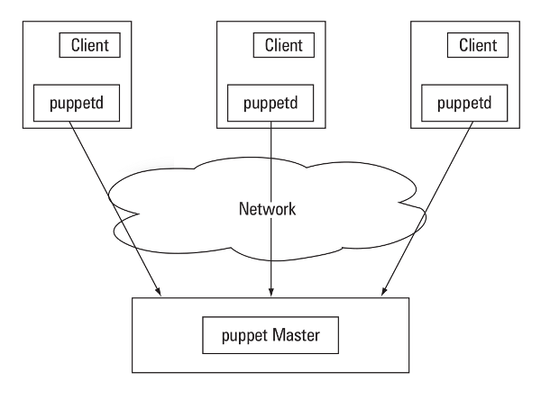
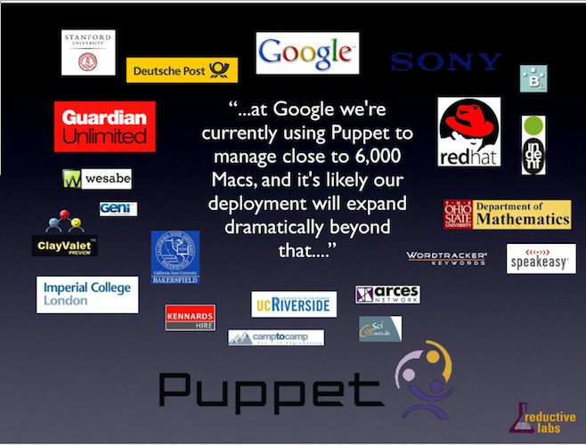

!SLIDE subsection

# Rapid and repeatable server setup#
## Configuration management with Puppet ##

!SLIDE incremental

# What is configuration management? #

 
 
* Writing the system configuration of your servers in files
* Applying these files automatically
* That's it!

!SLIDE

# Why do configuration management? #

 
 
* To do fast cluster deployment: who wants to manually setup 50 EC2 servers???
* To do fast crash-recovery: configuration management is the best documentation for a server's setup
* To have consistent environments for development and production

!SLIDE

# Puppet or Chef#
## Configuration management tools ##

* Two popular recent tools for configuration management: Puppet and Chef
* A master server contains different "recipes" describing system configurations
* Client servers connect to the master server, read their recipe, and apply the configuration

!SLIDE center

# Puppet #

!SLIDE center

# Puppet references #

!SLIDE center

# Let us create a Symfony-ready server with Puppet #
## Introduction to Puppet manifests ##

!SLIDE smaller

	class lighttpd
	{

	  package { "apache2.2-bin":
	    ensure => absent,
	  }

	  package { "lighttpd":
	    ensure => present,
	  }

	  service { "lighttpd":
	    ensure => running,
	    require => Package["lighttpd", "apache2.2-bin"],
	  } 

	}

!SLIDE smaller

	class lighttpd-phpmysql-fastcgi inherits lighttpd
	{

	  package { "php5-cgi":
	    ensure => present,
	  }

	  package { "mysql-server":
	    ensure => present,
	  }

	  exec { "lighttpd-enable-mod fastcgi":
	    path    => "/usr/bin:/usr/sbin:/bin",
	    creates => "/etc/lighttpd/conf-enabled/10-fastcgi.conf",
	    require =>  Package["php5-cgi", "lighttpd"],
	  }

	}

!SLIDE smaller

	class symfony-server inherits lighttpd-phpmysql-fastcgi
	{

      package { ["php5-cli", "php5-sqlite"]:
        ensure => present,
        notify  => Service["lighttpd"],
      }

	  package { "git-core":
	    ensure => present,
	  }

	  exec { "git clone git://github.com/symfony/symfony1.git":
	    path    => "/usr/bin:/usr/sbin:/bin",
	    cwd => "/var/www",
	    creates => "/var/www/symfony1",
	    require => Package["lighttpd", "git-core"],
	  }

	}

!SLIDE smaller

	class symfony-live-server inherits symfony-server
	{

	  file { "/etc/lighttpd/conf-available/99-hosts.conf":
	    source => "/vagrant/files/conf/hosts.conf",
	    notify  => Service["lighttpd"],
	  }

	  exec { "lighttpd-enable-mod hosts":
	    path => "/usr/bin:/usr/sbin:/bin",
	    creates => "/etc/lighttpd/conf-enabled/99-hosts.conf",
	    require => File["/etc/lighttpd/conf-available/99-hosts.conf"],
	    notify  => Service["lighttpd"],
	  }

	}

	include symfony-live-server
	notice("Symfony server is going live!")

!SLIDE

# Why not use shell scripts? #

 
 
 
 

* Shell scripts are for administrators. Is all your team composed of admin experts?
* Even for admin experts, Puppet and Chef recipes are more readable
* Puppet and Chef make inheritance and modules easy
* Puppet and Chef are <strong>idempotent</strong>: running them twice in a row will not break your system

!SLIDE subsection

# Develop and test on the same environment as in production! #
## VM provisioning with Vagrant ##

!SLIDE incremental

# Develop on local Virtual Machines #
## Vagrant ##

* Vagrant is a tool to create local VirtualBox VMs, configured automatically by your Chef recipe or Puppet manifest 
* It ensures you test on the same environment as your production server
* It is VERY easy

!SLIDE small

# All you need is: #
## Vagrant ##

 
 
 
 

* A Puppet manifest
* A few system config files
* A Vagrant conf file

!SLIDE small

# Demonstration #
## Vagrant ##

 
 
 
 

    $ git clone git://github.com/fabriceb/sflive2011vm.git .
    $ git clone git://github.com/fabriceb/sflive2011.git
    $ vagrant up

 
 
 
 
 
 
    http://127.0.0.1:2011/
