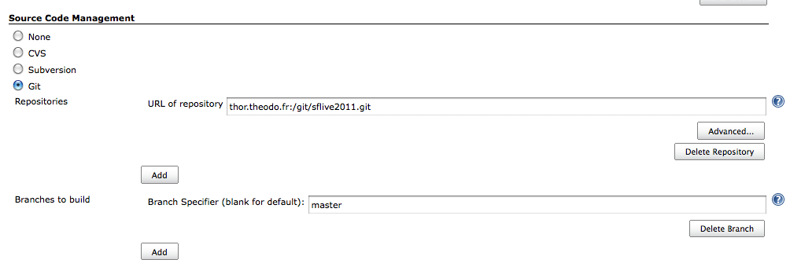
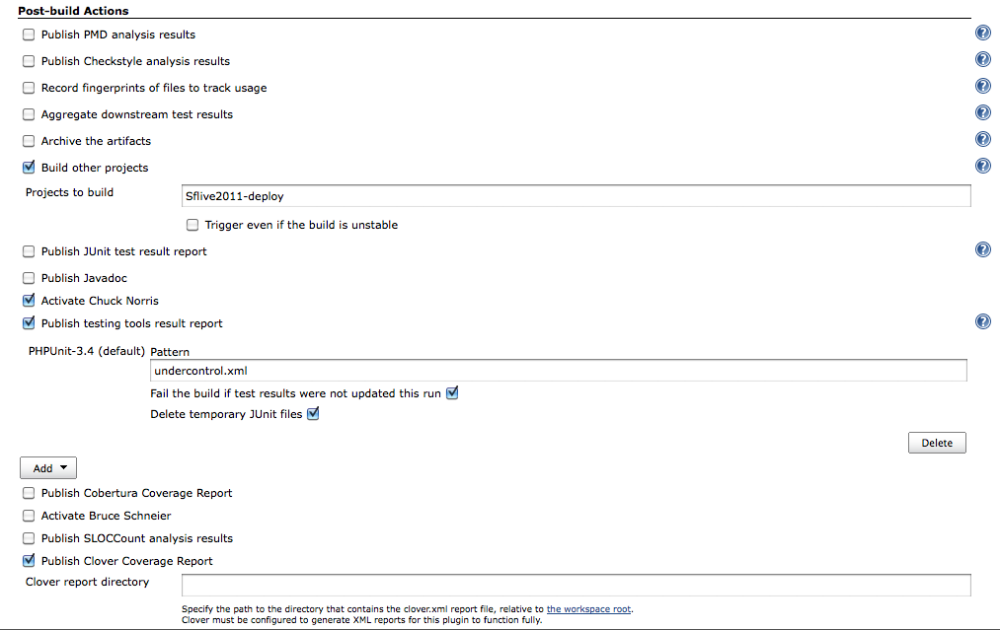
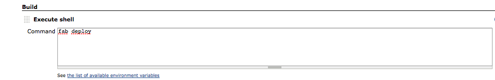

!SLIDE subsection

# And why not let Jenkins deploy himself? #
## Continuous deployment ##

!SLIDE center

# The Holy Grail of Rapid App Development & Deployment: #
## Automate everything low value-added ##

### and relax ###

!SLIDE incremental

# Isn't it dangerous to trust a machine? #
## Errare humanum est ##

* Of course you need continuous integration with MANY tests
* Of course you need some serious monitoring on the production server
* Of course you need some good rollback scripts
* But aren't that good things to do anyway ?
* <strong>Good continuous integration is more reliable than a human!</strong>

!SLIDE incremental

# You need to separate dev, pre-prod and prod... #
## Continuous deployment howto ##

### For example with git: ###
* features/* branches for small projects
* dev branch for merging team development
* master branch for production-ready code
* prod/* tags for production

!SLIDE incremental

# And you need a deployment script + Jenkins #
## Continuous deployment howto ##

* Deployment script using Fabric (for example)
* Jenkins (formerly known as Hudson) to test and deploy

!SLIDE center

# Create a new Jenkins project testing only branch master #

!SLIDE center

# Specify "Build other projects" in the post-build actions #

!SLIDE center

# Don't forget to activate Chuck Norris #

!SLIDE center

# Create a second Jenkins project to execute the deploy script #

!SLIDE center

# That's it! #