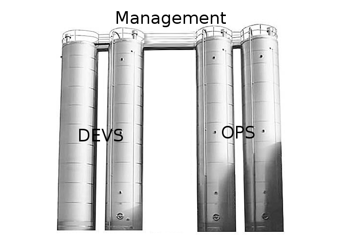
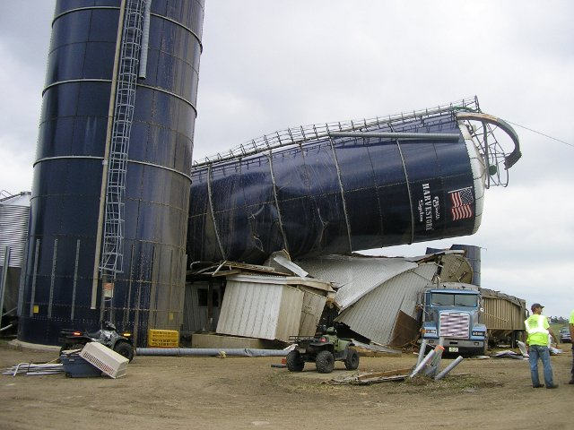
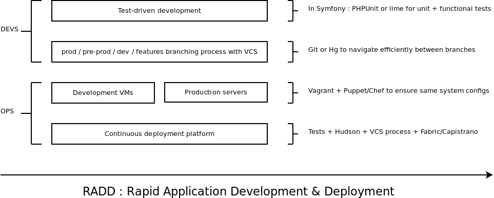

!SLIDE subsection

# What is DevOps? #
## Introduction ##

!SLIDE center

# How many here consider themselves SysAdmins? #

!SLIDE center

# How many here have <strong>never</strong> deployed an application on a server? #

!SLIDE

# Wikipedia #
## Definition of DevOps ##

 
 
 

### <em>DevOps is a set of processes, methods and systems for communication, collaboration and integration between departments for Development (Applications/Software Engineering), Technology Operations and Quality Assurance (QA).</em> ###

### <em>It relates to the emerging understanding of the interdependence of development and operations in meeting a business' goal to producing timely software products and services</em> ###

!SLIDE incremental

# The fundamental DevOps contradiction #
## Devs VS Ops #

* Developers are asked to deliver new value, often and fast

* Operations people are asked to protect the current value

* <strong>Pro-Change VS Pro-Stability</strong> 

!SLIDE center

# Silos #

!SLIDE center

# Break the silos #

!SLIDE center

# DevOps do RADD #

!SLIDE

# DevOps create the infrastructure that empower devs from the first line of code to the delivery #
## How to be DevOps?

* Configuration management for rapid, repeatable server setup
* Deployment scripts to abstract sysadmin tasks and empower developers
* Development VMs with prod configuration to ensure consistency and avoid unexpected system-related bugs
* Continuous deployment to make it <strong>fast</strong>!

!SLIDE center

# DevOps is spreading agility to the whole IT project lifecycle #